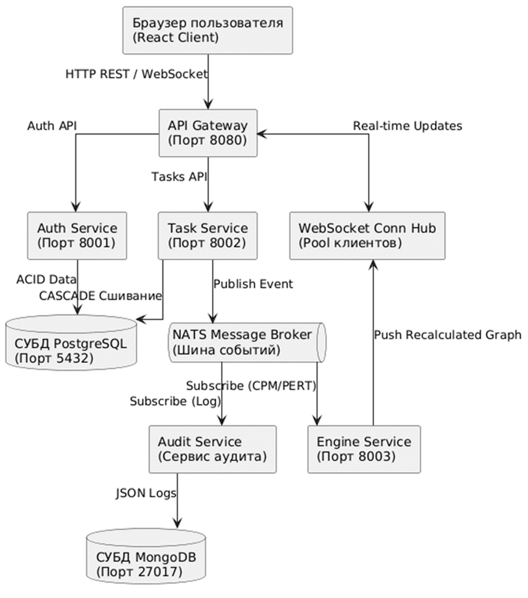
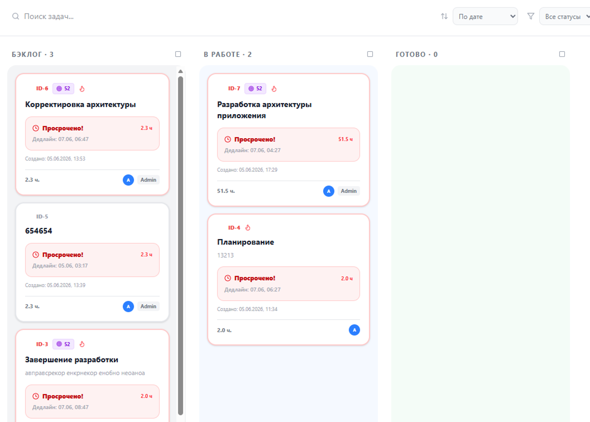
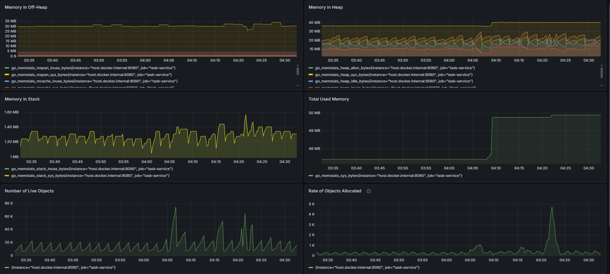

# SmartSync — Event-Driven Task Management Platform 🚀


SmartSync is an event-driven task management platform (Kanban) built with Go. It serves as a proof-of-concept for a scalable microservices architecture. The system uses mathematical task evaluation (PERT / CPM) to automatically build dependency graphs and identify the critical path of a project in real-time.

## 🎥 Demo & Previews

https://github.com/user-attachments/assets/519bdebc-20a5-4a28-84b7-58396e70c9ec

*(See the `docs/` folder for more interface and monitoring screenshots)*

## 🛠 Tech Stack

* **Backend:** Go (Golang)
* **Databases:** PostgreSQL (Core ACID data), MongoDB (Audit logs), Redis (Graph caching)
* **Message Broker:** NATS (Async event streaming)
* **Frontend:** React, Vite, TailwindCSS
* **Infrastructure & DevOps:** Docker, Docker Compose
* **Observability:** Prometheus, Grafana

## ✨ Key Features & Architecture

* **API Gateway Pattern:** Single entry point featuring IP-based Rate Limiting and a Circuit Breaker (`gobreaker`) to prevent cascading service failures.
* **Event-Driven Communication:** Microservices are loosely coupled and communicate asynchronously via NATS.
* **Math Engine:** A background Priority Service that runs a Depth-First Search (DFS) algorithm to recalculate task priorities, weights, and deadlines based on PERT estimations.
* **Immutable Audit Trail:** An isolated audit service that listens to NATS events and stores all state changes in MongoDB.
* **Real-time WebSockets:** UI updates (status changes, new connections) are pushed to clients instantly via WebSockets directly from the event broker.



## 🏗 Microservices Layout

* **`gateway`**: Routing, JWT validation, WebSocket hub, Rate Limiting, and Circuit Breaker.
* **`auth-service`**: User authentication, RBAC, and JWT generation.
* **`task-service`**: Core CRUD for projects/tasks and dependency graph management.
* **`audit-service`**: NATS subscriber that writes system event logs to MongoDB.
* **`priority-service`**: Background math engine for graph and critical path calculations.
* **`deadline-service`**: Cron-like worker tracking deadlines and pushing alerts.

## 🚀 Quick Start

The project is fully containerized. You can spin up the entire infrastructure with a single command.

### 1. Clone the repository
```bash
git clone [https://github.com/YOUR_GITHUB_NAME/SmartSync.git](https://github.com/YOUR_GITHUB_NAME/SmartSync.git)
cd SmartSync
```

### 2. Run with Docker Compose
```bash
docker-compose up -d --build
```

### 3. Access the Services
Once all containers are up and running, the services will be available at:
* **Frontend UI:** `http://localhost:80`
* **API Gateway:** `http://localhost:8000`
* **Grafana:** `http://localhost:3000` *(Login: admin / Password: admin)*
* **Prometheus:** `http://localhost:9090`



## 🔌 API Reference (Examples)

All requests should be routed through the API Gateway at `http://localhost:8000`. 
Protected routes require the `Authorization: Bearer <token>` header.

### Authentication
**Login / Get Token**
```http
POST /login
Content-Type: application/json

{
  "username": "admin",
  "password": "password123"
}
```

### Tasks (Protected)
**Create a Task with PERT estimations**
```http
POST /tasks
Authorization: Bearer <token>
Content-Type: application/json

{
  "project_id": 1,
  "title": "Design Database Schema",
  "description": "Create ERD for the microservices.",
  "opt": 2,
  "real": 4,
  "pess": 8
}
```

**Link Tasks (Dependency)**
*Note: This triggers a NATS event to recalculate the critical path in the background.*
```http
POST /tasks/55/dependencies
Authorization: Bearer <token>
Content-Type: application/json

{
  "depends_on_id": 54
}
```

**Change Status**
```http
PATCH /tasks/54/status
Authorization: Bearer <token>
Content-Type: application/json

{
  "status": "in_progress" 
}
```

### Audit (Protected)
**Fetch Action History for a Task**
```http
GET /logs/54
Authorization: Bearer <token>
```


